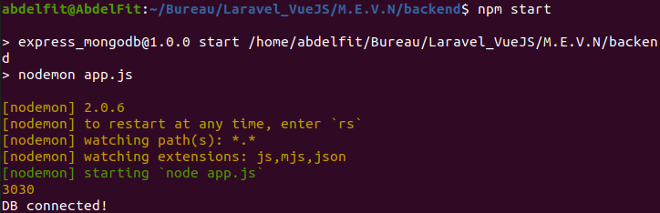

<h1 align="center">
🌐 M.E.V.N Stack
</h1>
<p align="center">
MongoDB, Expressjs, React/Redux, Nodejs
</p>

# Table of contents
* [General info](#general-info)
* [M.E.V.N Backend](#m.e.v.n-backend)
* [clone or download](#clone-or-download)
* [Project structure](#project-structure)
* [Prerequirement](#prerequirement)
* [Setup](#setup)
* [Dependencies](#dependencies)
* [Screenshots](#screenshots)

# General info
> M.E.V.N is a fullstack implementation in MongoDB, Expressjs, VueJS and Nodejs.

M.E.V.N stack is the idea of using Javascript/Node for fullstack web development.

*Most people use ReactJS (M.E.R.N) instead of VueJS, but I chose Vue, because why not?!*

This project consist

# M.E.V.N Backend
This is the Server-Side of the project M.E.V.N.
*You may find the Client-Side [here]().*

The project consists in giving the possibility to people to be able to first create an account and connect, and once they connect they can:
- create posts, modify or delete them
- see all posts and their comments
- add comments, modify or delete them
- see their own profile, all their posts and comments as well as modify their profile informations (username, bio, password)
- see other users' profiles as well as all their posts and comments

# Clone or download
```
$ git clone ...
$ npm i
```

# Project structure
```
package.json
app.js (the main app)
.env (to create)
Controllers/
	...
DB/
	index.js
Middlewares/
	index.js
Models/
	...
routes/
	...
Validation
	...
```

# Prerequirement
* [JavaScript](#https://developer.mozilla.org/en-US/docs/Web/JavaScript)
> *You need to have a know the basics of JS*
* [NodeJS](#https://nodejs.org/en/) ^10.16.3 
> *To check node's version: node -v*
* [npm](#https://www.npmjs.com/get-npm) 
> *If you have installed NodeJS you'll get npm with it*
> *To check npm's version: npm -v*
* [MongoDB](#https://www.mongodb.com/2) 
> *You have to create a cluster and connect it with this project*

# Setup 

### Start
- SignUp or Login to your MongoDB profile and add a new project
> *[Here](#https://www.youtube.com/watch?v=Qn0SOL8vK8w) is a video on how to connect MongoDB with your project*
- Create a .env file and add:
```
PORT = *Choose a port, ex: 3030*

DB_CONNECTION = *Here you should put the URL of your MongoDB cluster*

TOKEN_SECRET = *You can write anything like: qfhgqfioqfhqgfsdqgfhdsfhruiocbiyebr*
```

### Setup
```
npm i
npm start
```

# Dependencies
Package | Version | installation
--- | --- | ---
[bcryptjs](#https://www.npmjs.com/package/bcryptjs) | ^2.4.3 | npm i bcryptjs
[body-parser](#https://www.npmjs.com/package/body-parser) | ^1.19.0 | npm i body-parser
[dotenv](#https://www.npmjs.com/package/dotenv) | ^8.2.0 | npm i dotenv
[express](#https://www.npmjs.com/package/express) | ^4.17.1 | npm i express
[express-validator](#https://www.npmjs.com/package/express-validator) | ^6.8.0 | npm i express-validator
[jsonwebtoken](#https://www.npmjs.com/package/jsonwebtoken) | ^8.5.1 | npm i jsonwebtoken
[mongoose](#https://www.npmjs.com/package/mongoose) | ^5.11.5 | npm i mongoose
[nodemon](#https://www.npmjs.com/package/nodemon) | ^2.0.6 | npm i nodemon

# Screenshots
Once everything is setup and installed, when you run npm start, you will see
```
3030
DB connected!
```
